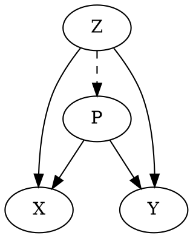

# mdc -- markdown compiler (markdown-to-markdown)

Markdown + some special syntax

## Basic usage

```bash
mdc < in.md > out.md
mdc < in.md | pandoc -o out.html
```

## Special Syntax

### `@[filetype](filepath)` include

```markdown
@[filetype](filepath)
```

`filepath` embedded as `filetype`

i.e.

```
｀｀｀[filetype]
(content of filepath)
｀｀｀
```

e.g. `@[ruby](example.rb)`

### `dot` (graphviz)

`mdc` finds dot code-blocks and translates to `<svg>` images.



to a svg image (also see `sample/out.html`).

### `<` exec

The line which begins with `< ` (leftangle-space)

```markdown
< system command
```

exec `system command` (in bash) and the stdout embeded

e.g.

```markdown
compiled date is
< date
```

