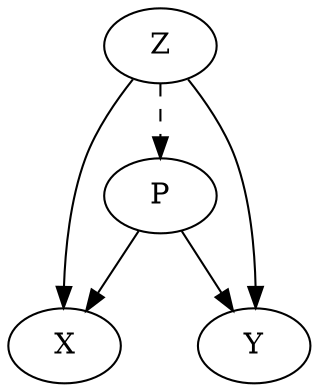

# mdc -- markdown compiler (markdown-to-markdown)

Markdown + some special syntax

## Basic usage

```bash
mdc < in.md > out.md
mdc < in.md | pandoc -o out.html
```

## Special Syntax

### include system

You can embed the content of another file.
If the file is markdown (`.md`, `.mkd`), the content will be embbed after compiled with `mdc`
(please see `tests/include-nest/actual.md`).

#### Format:

```markdown
@(filepath)
```

replaces the content of the file.

#### Example:

```markdown
@(section1.md)
```

makes

```
(content of section1.md)
```

### include system as a code snippet

#### Format:

```markdown
@[filetype](filepath)
```

#### Example:

```markdown
@[ruby](example.rb)
```

makes

<pre>
```ruby
(content of example.rb)
```
</pre>

### graphviz (dot)

graphviz (dot) is a tool which make graph (nodes and edges) images.
`mdc` calls `dot` and makes svg images when

<pre>
```dot
    ...
    ...
```
</pre>

snippet found.

#### Example:

<pre>

</pre>

### gnuplot

requires `gnuplot` and `svg` terminal.

<pre>
```gnuplot
    ...
    ...
```
</pre>

#### Example:

<pre>
```gnuplot
plot sin(x)
```
</pre>

### `<` exec

The line which begins with `< ` (leftangle-space) will be interpreted as shell (bash) code, and executed.

#### Format:

```markdown
< system command
```

#### Example:

```markdown
This document was compiled at
< LANG=en date
.
```

```markdown
10 count:
< seq 1 10 | tr '\n' ' '
```

### `[[ ]]` link text == address

```markdown
[[URL]]
```

makes

```markdown
[HTML-Title](URL)
```

if `HTML-Title` can be fetched successfully,
else

```markdown
[URL](URL)
```

### `{{ }}` OGP Block Link

```markdown
{{URL}}
```
