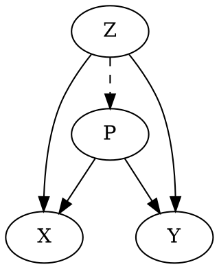

# mdc -- markdown compiler (markdown-to-markdown)

## Basic usage

`mdc` is an executable script (in Ruby),
which read markdown from stdin
and otuput compiled markdown to stdout.


```bash
mdc < in.md > out.md
```

or if you wish pandoc

```bash
mdc < in.md | pandoc -o out.html
```

## dot (graphviz)

`mdc` finds dot code-blocks and translates to `<svg>` images.

### Example



to a svg image (also see `sample/out.html`).
